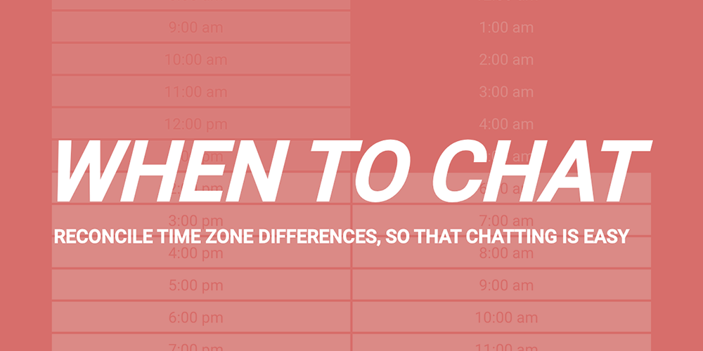

# When to chat
---
## ⚠️ Archived: Please refer to https://github.com/nbw/whentwochat instead. 
---

A tool to help resolve time zone differences. 

Check it out at [whentochat.co](https://whentochat.co).

## Tech

* Gatsby for static site
* Google Maps for location data
* Hosted on Netlify
* Query Bitly via an AWS Lambda

## Thanks

I recieved feedback from a lot of friends. Notably a few people in particular:

* [Drew](https://twitter.com/grmnygrmny)
* [Valentina](https://twitter.com/ScintillaLuz)
* [Nick](https://twitter.com/nbrempel)

Thanks guys!

## Feedback

Shoot me an email with suggestions.
